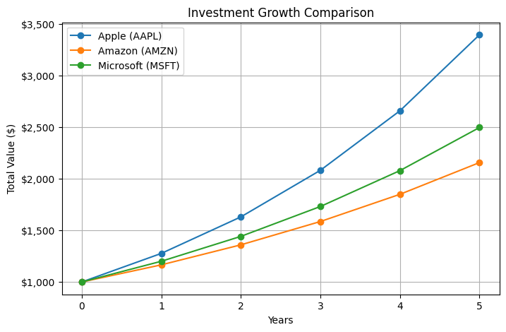

🌍 World Model
📌 Overview

The World Model project is an advanced AI-driven system designed for predictive modeling, decision-making, and data-driven insights. This notebook explores various aspects of world modeling, including machine learning techniques, data analysis, and computational simulations.
🚀 Features

    📈 Predictive Modeling: Leverages machine learning algorithms to make future predictions.
    📊 Data Analysis & Visualization: Provides insightful visualizations for better understanding.
    🤖 AI-Powered Insights: Uses state-of-the-art deep learning models.
    ⚡ Dynamic Simulations: Implements real-world scenario modeling.

🛠️ Tech Stack

    Programming Language: Python
    Libraries Used:
        NumPy, Pandas (for data manipulation)
        Matplotlib, Seaborn, Plotly (for visualization)
        Scikit-Learn, TensorFlow/PyTorch (for machine learning)
        Jupyter Notebook (for interactive development)

📊 Visualizations
Live Tech Stock Heatmap
.png)

(Sized by Market Cap & Colored by % Change)
Investment Growth Comparison


📂 Project Structure

World_Model/
│── World_Model.ipynb   # Main notebook
│── README.md           # Project documentation
│── images/             # Folder for images & visualizations

📌 Installation

    Clone the repository:
```
git clone https://github.com/yourusername/world_model.git](https://github.com/AruneshDev/Stock-Market-Dashboard-and-Investment-Calculator.git)
```
Navigate into the project folder:
```
cd world_model
```
🚀 Usage

    Open Jupyter Notebook:

    jupyter notebook
    ```
    Run World_Model.ipynb step by step to explore different world modeling techniques.
    ```
📌 Future Improvements

    Enhance deep learning models for better predictions.
    Expand dataset and include real-time data processing.
    Optimize computational performance.

